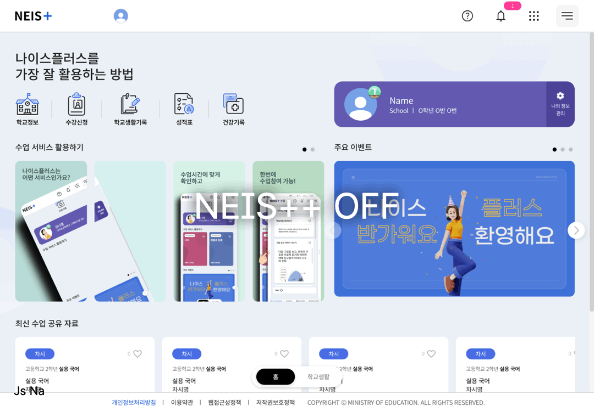

# NEIS++ | Enhance NEIS+(Korean National Education Information System) Student Service UX.

[한국어 버전 이용 가능](./README.md)


## Disclaimer

This project was created for the purpose of learning Chrome extension development, not for hacking NEIS+ or interfering its operation.

To the extent you choose to access and use this Extension Software, you do so at your own initiative and are responsible for compliance with any applicable laws.

You should not use this Extension Software with important data.

The developer shall not be responsible for any costs, expenses or other liabilities you may incur as a result of using this Extension Software, including but not limited to any damage, loss, or corruption of any software, information or data.

THIS EXTENSION SOFTWARE IS PROVIDED “AS IS” AND “AS AVAILABLE”, WITH ALL FAULTS AND WITHOUT WARRANTY OF ANY KIND, AND THE DEVELOPER HEREBY DISCLAIM ALL WARRANTIES AND CONDITIONS WITH RESPECT TO THE EXTENSION SOFTWARE, EITHER EXPRESS, IMPLIED, OR STATUTORY, INCLUDING, BUT NOT LIMITED TO, THE IMPLIED WARRANTIES AND/OR CONDITIONS OF MERCHANTABILITY, OF SATISFACTORY QUALITY, OF FITNESS FOR A PARTICULAR PURPOSE, OF ACCURACY, OF QUIET ENJOYMENT, AND OF NONINFRINGEMENT OF THIRD-PARTY RIGHTS.

## Motivation

Starting with the public beta test in 2023, the service for the 4th generation (self-proclaimed) intelligent NEIS has begun.

The NEIS+ service, like many government services in South Korea, has faced significant complaints from students and teachers since its launch.¹

A rushed launch schedule caused various errors in the student service, as well as critical issues including exam information from other schools being printed in the teacher service.²

This was the result of multiple isseues converging: the forced launch during the semester, restrictions on large corporations' participation resulting in development by small and medium-sized SI companies, and more.

On the ground, the service drew harsh criticism as **low-intelligence**, making the term **intelligent** meaningless.⁴

Especially for the dark mode feature, it was available during the beta testing period, but was never fully completed.

Eventually, after the launch of the full service, support for the dark mode was discontinued with a notice stating "to be updated later", and even nearly three years after the launch of NEIS+, it is still unsupported.

Therefore, I planned this project to learn how to develop Chrome extensions and to improve the user experience of the NEIS+, even if only slightly.

## Goals

The goals are:

1. Supporting dark mode.
2. Improving the design.

## Analysis of NEIS+


Upon accessing the NEIS+ service, it prints a summary of the client environment to the console, then initiates an infinite loop of `console.clear()` with codes to avoid debugging.
```
...
var diff_1 = 350;
setInterval(function(script) {
    console.clear();
    var st = performance.now();
    eval(script),
    performance.now() - st > diff_1 && (alert(msg),
    window.location.assign("/"))
}, time, "debugger;")
...
```
It calls the debugger every 1000ms, and when the debugger is called to activate a breakpoint, it redirects user to the landing page.
But I'm not sure if it's worth it, since it can be bypassed with just a few clicks.


## Structure of NEIS+'s theme.

When dark mode or themes from the lab(for testing new features) is not enabled, it loads empty CSS files that include `def` in their names, suck as `dark/defDark.css` and `lab/theme/stdLabDef.css`.

And once the theme is enabled, it loads the CSS file full of`!important` declarations(...) to override the design of the default stylesheet.

It appeares that during this process, they determined it would be difficult to invert the color of almost every text and backgrounds.

This is probably why all themes from the lab are in bright color schemes with only slight variations in hue.

## Applying Dark Mode

Using only `!important`to override styles is not likely the best approach, as even the developers of NEIS+ appear to have failed with this method.

However, as NEIS+'s servers still have the dark mode CSS from the beta days, I determined it'd be the most effective approach to polish only the unfinished parts based on that CSS.

So, based on that CSS file, I have reduced the duplicated sections and used script injection to replace images that can't be done via CSS replacement.
> For now, the dark mode can be toggled on the extension options page, but I plan to implement a feature that enables it based on the devices' theme settings.

## Design Improvements

NEIS+ was developed prior to the publication of the [Digital Government Services UI/UX Guidelines](https://v04.krds.go.kr/guide/index.html), so there are differences in design compared to other Korean government services.

I aim to apply the [latest version of KRDS](https://www.krds.go.kr/html/site/index.html), even if I can't reflect all elements.

> At first, I applied the [Pretendard GOV](https://www.krds.go.kr/html/site/style/style_03.html) font specified in the guidelines.

Separate from KRDS, I've applied some blur effects to my personal preference. (Can be removed later)

## Results (Screen Shot)




## Installation

1. [Download Release](https://github.com/hellojsna/NEISPlusPlus/releases) and extract the downloaded file.
2. Open [chrome://extensions](chrome://extensions) page.
3. Enable developer mode, then select the **Load unpacked**.
4. Select the extracted directory.

## Usage

Enable the extension and Open [NEIS+](https://neisplus.kr).

You can toggle dark mode in the extension options page.

---

1. ['4세대 나이스 대란 총체적 부실' 교육부 책임론](https://www.ihopenews.com/news/articleView.html?idxno=238259) - 호남교육신문 2024. 08. 27.
2. ["다른 학교 정답 유출됐다"…2800억짜리 '4세대 나이스' 대혼돈](https://www.joongang.co.kr/article/25172100) - 중앙일보 2023. 06. 23.
3. [[단독] 4세대 나이스에 교사 원성 "이해못할 계약"](https://www.mk.co.kr/news/society/10845764) - 매일경제 2023. 10. 09.
4. ["지능형 아닌 저능형 나이스"...2824억 투입한 나이스, 학교 혼란 가중](https://www.edpl.co.kr/news/articleView.html?idxno=9591) - 교육플러스 2023. 06. 22.