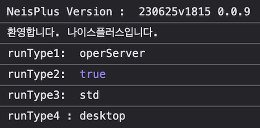

# NEIS++ - 학생용 NEIS+ 서비스 사용 환경 개선

[한국어 버전 이용 가능](./README.md)

## 프로젝트 제작 동기

Starting with the public beta test in 2023, the service for the 4th generation (self-proclaimed) intelligent NEIS has begun.

The NEIS+ service, like many government services in South Korea, has faced significant complaints from students and teachers since its launch.¹

A rushed launch schedule caused various errors in the student service, as well as critical issues including exam information from other schools being printed in the teacher service.²

This was the result of multiple isseues converging: the forced launch during the semester, restrictions on large corporations' participation resulting in development by small and medium-sized SI companies, and more.

On the ground, the service drew harsh criticism as **low-intelligence**, making the term **intelligent** meaningless.⁴

Especially for the dark mode feature, it was available during the beta testing period, but was never fully completed.

Eventually, after the launch of the full service, support for the dark mode was discontinued with a notice stating "to be updated later", and even nearly three years after the launch of NEIS+, it is still unsupported.

Therefore, I planned this project to learn how to develop Chrome extensions and to improve the user experience of the NEIS+, even if only slightly.

## 목표 설정

기본 목표는 다음과 같습니다.

1. 다크 모드의 복원
2. 디자인 개선

## NEIS+ 분석



NEIS+ 서비스에 접속하면 콘솔에 간단한 접속 환경이 출력된 후 디버깅을 방지하기 위한 코드와 console.clear()의 무한 호출이 시작됩니다.
```
...
var diff_1 = 350;
setInterval(function(script) {
    console.clear();
    var st = performance.now();
    eval(script),
    performance.now() - st > diff_1 && (alert(msg),
    window.location.assign("/"))
}, time, "debugger;")
...
```
debugger를 1000ms 간격으로 호출하고 debugger가 호출되어 breakpoint가 활성화되면 사용자를 랜딩 페이지로 이동시킵니다.
다만 클릭 몇 번이면 무시할 수 있기에 의미가 있는지는 잘 모르겠습니다.


## NEIS+의 테마 적용 구조

다크 모드나 실험실 테마가 활성화되지 않은 상태에서는 `dark/defDark.css`, `lab/theme/stdLabDef.css`등 `def`가 이름에 포함된 빈 CSS파일을 로드합니다.

그리고 테마가 활성화되면 `!important`가 가득한(...) CSS를 적용해 기본 디자인을 덮어씌웁니다.

이 과정에서 사실상 모든 텍스트와 배경 색을 반전시키는 것이 어렵다고 판단한 것으로 보입니다.

실험실 테마가 모두 밝은 계열에 색상만 조금씩 변화시킨 형태로 된 이유도 이것으로 추정됩니다.

## 다크 모드 적용 

`!important`만을 이용해서 덮어씌우는 것은 NEIS+의 개발자들도 실패한 것으로 보이기에 최선의 방법은 아닐 것입니다.

다만 NEIS+의 서버에는 베타 테스팅 당시의 다크 모드 CSS가 남아있고, 이를 기반으로 미완성이었던 부분만 개선하는 것이 효율적일 것이라 판단했습니다.

이에 해당 CSS를 기반으로 중복되는 부분을 줄이고, 스크립트를 사용해 CSS로 교체가 불가능한 일부 이미지들을 변경하도록 했습니다.

> 우선 설정 페이지에서 다크 모드를 토글할 수 있게 했지만, 추후 디바이스 테마 설정에 따라 자동으로 활성화되도록 기능을 추가할 예정입니다.

## 디자인 개선

[디지털 정부서비스 UI/UX 가이드라인](https://v04.krds.go.kr/guide/index.html)의 공개 이전에 제작되어 다른 정부 서비스들과의 디자인 차이가 존재합니다.
완벽하지는 않더라도 KRDS를 적용하는 것을 목표로 합니다.

> 우선 첫번째로 가이드라인에 명시된 [Pretendard GOV](fonts/pretendard-gov-subset.css) 서체를 적용했습니다.

KRDS와 별도로 우선 제 취향에 맞춘 블러 효과를 적용했습니다.(추후 제거 가능)

---

1. ['4세대 나이스 대란 총체적 부실' 교육부 책임론](https://www.ihopenews.com/news/articleView.html?idxno=238259) - 호남교육신문 2024. 08. 27.
2. ["다른 학교 정답 유출됐다"…2800억짜리 '4세대 나이스' 대혼돈](https://www.joongang.co.kr/article/25172100) - 중앙일보 2023. 06. 23.
3. [[단독] 4세대 나이스에 교사 원성 "이해못할 계약"](https://www.mk.co.kr/news/society/10845764) - 매일경제 2023. 10. 09.
4. ["지능형 아닌 저능형 나이스"...2824억 투입한 나이스, 학교 혼란 가중](https://www.edpl.co.kr/news/articleView.html?idxno=9591) - 교육플러스 2023. 06. 22.