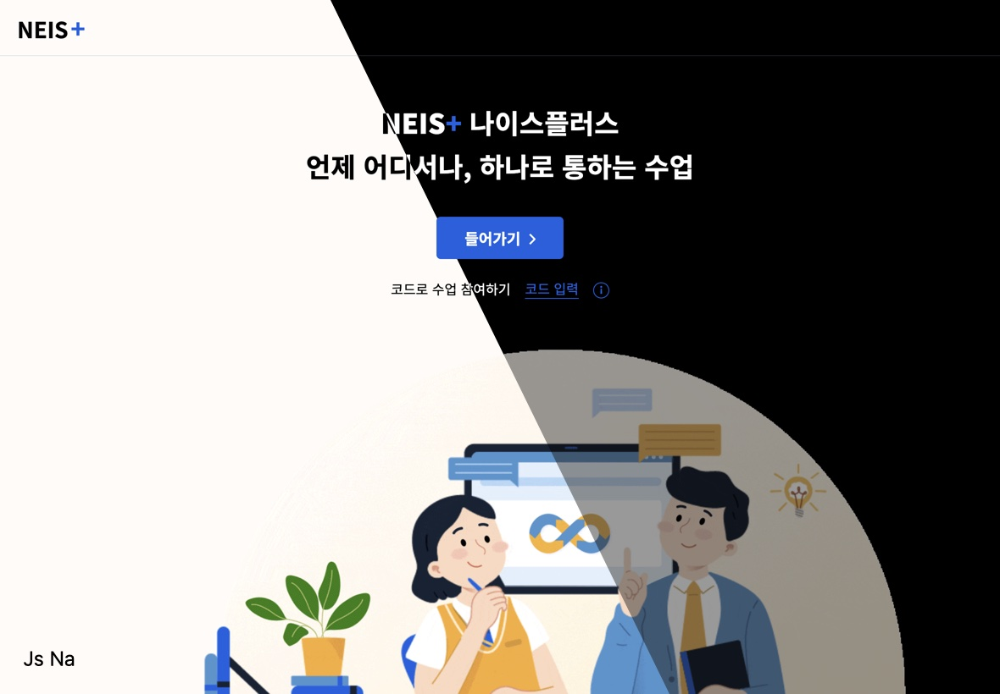
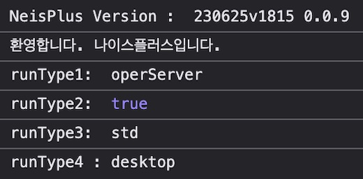
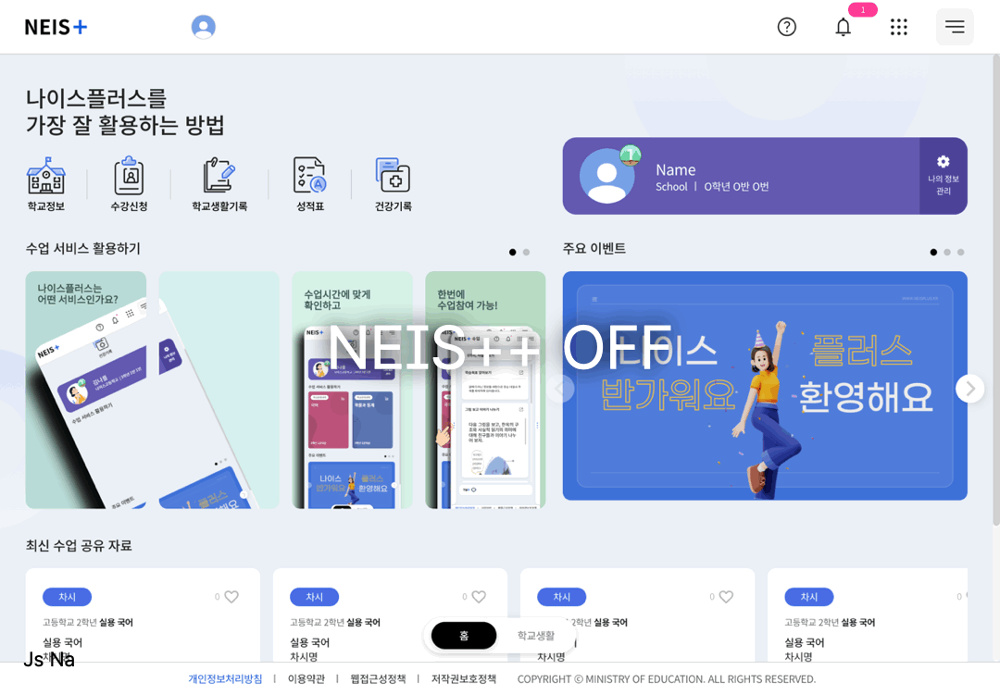
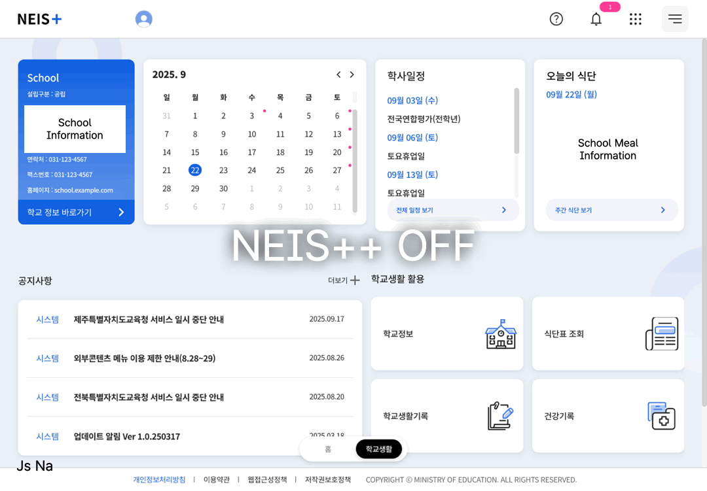
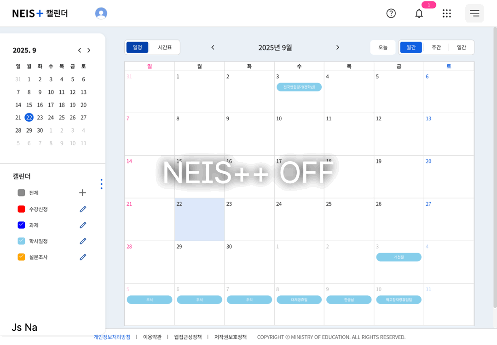

# NEIS++ | 학생용 NEIS+ 서비스 사용자 경험 개선

[English Version Available](./README.en.md)



## Disclaimer

이 프로젝트는 NEIS+를 해킹하거나 운영 상에 방해를 하기 위한 것이 아닌, Chrome 확장 프로그램 개발의 학습을 목적으로 제작되었습니다.

귀하가 본 확장 프로그램 소프트웨어에 접근하고 사용하는 범위 내에서 그러한 사용은 본인의 결정에 의한 것이며, 귀하는 관련 법률을 준수할 책임이 있습니다.

귀하는 중요한 데이터에 대하여 본 확장 프로그램 소프트웨어를 사용하지 않아야 합니다.

소프트웨어, 정보, 데이터 등의 손상, 손실 등을 포함하되 이에 국한되지 않는, 본 확장 프로그램 소포트웨어의 사용으로 인하여 발생할 수 있는 비용, 경비 또는 기타 부채에 대하여 개발자는 책임이 없습니다.

본 확장 프로그램 소프트웨어는 어떠한 보증도 없이 모든 결함이 포함된 상태에서 '있는 그대로', '사용할 수 있는 대로'의 상태로 제공되며, 이에 따라 개발자는 본 확장 프로그램 소프트웨어에 대해 상품성, 만족스러운 품질, 특정 용도에 대한 적합성, 정확성, 향유권 및 제삼자의 권리 비침해에 대한 묵시적인 보증 및/또는 조건을 포함하되 이에 국한되지 않는 명시적, 묵시적, 법적인 어떠한 보증 및 조건도 부인합니다.

---

## 프로젝트 제작 동기

2023년 공개 베타 테스트를 시작으로 4세대 (자칭)지능형 NEIS의 서비스가 시작되었습니다.

NEIS+ 서비스는 대한민국의 공공 서비스들이 늘 그랬듯 개통 후 학생과 교사에게 많은 불만이 발생했습니다.¹

무리한 개통 일정으로 학생 서비스에서 각종 오류들이 발생했고, 교사 서비스에서는 타 학교의 시험 문항 정보가 잘못 출력되는 등의 심각한 문제까지 발생했습니다.²

이는 학기 중 무리한 개통 강행, 대기업 참여 제한으로 인한 중소SI의 개발³ 등 복합적인 문제가 합쳐진 결과로, 현장에서는 **지능형**이라는 말이 무색하게 **저능형** 서비스라는 혹평까지 나왔습니다.⁴

특히 다크 모드 기능의 경우 베타 테스트 중 사용이 가능했으나, 완성되지 않은 상태였습니다.

결국 정식 서비스의 개통 후 "추후 제공 예정"이라는 안내와 함께 지원이 중단되었고, NEIS+의 개통이 3년이 되어가는 시점에도 지원되지 않고 있습니다.

이에 Chrome 확장 프로그램 개발 방법을 익히며 4세대 NEIS의 사용자 경험을 조금이나마 개선하기 위해 본 프로젝트를 기획하였습니다.

## 목표 설정

기본 목표는 다음과 같습니다.

1. 다크 모드 지원
2. 디자인 개선

## NEIS+ 분석



NEIS+ 서비스에 접속하면 콘솔에 간단한 접속 환경이 출력된 후 디버깅을 방지하기 위한 코드와 `console.clear()`의 무한 호출이 시작됩니다.
```
...
var diff_1 = 350;
setInterval(function(script) {
    console.clear();
    var st = performance.now();
    eval(script),
    performance.now() - st > diff_1 && (alert(msg),
    window.location.assign("/"))
}, time, "debugger;")
...
```
debugger를 1000ms 간격으로 호출하고 debugger가 호출되어 breakpoint가 활성화되면 사용자를 랜딩 페이지로 이동시킵니다.
다만 클릭 몇 번이면 무시할 수 있기에 의미가 있는지는 잘 모르겠습니다.


## NEIS+의 테마 적용 구조

다크 모드나 실험실 테마가 활성화되지 않은 상태에서는 `dark/defDark.css`, `lab/theme/stdLabDef.css`등 `def`가 이름에 포함된 빈 CSS파일을 로드합니다.

그리고 테마가 활성화되면 `!important`가 가득한(...) CSS를 적용해 기본 스타일시트의 디자인을 덮어씌웁니다.

이 과정에서 사실상 모든 텍스트와 배경 색을 반전시키는 것이 어렵다고 판단한 것으로 보입니다.

실험실 테마가 모두 밝은 계열에 색상만 조금씩 변화시킨 형태로 된 이유도 이것으로 추정됩니다.

## 다크 모드 적용 

`!important`만을 이용해서 디자인을 덮어씌우는 것은 NEIS+의 개발자들도 실패한 것으로 보이기에 최선의 방법은 아닐 것입니다.

다만 NEIS+의 서버에는 베타 테스팅 당시의 다크 모드 CSS가 남아있고, 이를 기반으로 미완성이었던 부분만 개선하는 것이 효율적일 것이라 판단했습니다.

이에 해당 CSS를 기반으로 중복되는 부분을 줄이고, 스크립트 인젝션을 통해 CSS로 교체가 불가능한 일부 이미지들을 변경하도록 했습니다.

> 우선 확장 프로그램 옵션 페이지에서 다크 모드를 토글할 수 있게 했지만, 추후 디바이스 테마 설정에 따라 자동으로 활성화되도록 기능을 추가할 예정입니다.

## 디자인 개선

NEIS+는 [디지털 정부서비스 UI/UX 가이드라인](https://v04.krds.go.kr/guide/index.html)의 공개 이전에 제작되어 다른 정부 서비스들과의 디자인 차이가 존재합니다.
완벽하지는 않더라도 [최신 버전의 KRDS](https://www.krds.go.kr/html/site/index.html)를 적용하는 것을 목표로 합니다.

> 우선 첫번째로 가이드라인에 명시된 [Pretendard GOV](https://www.krds.go.kr/html/site/style/style_03.html) 서체를 적용했습니다.

KRDS와 별도로 우선 제 취향에 맞춘 블러 효과를 적용했습니다.(추후 제거 가능)

## 결과(스크린샷)







## 설치

1. [Repository를 zip으로 다운로드](https://github.com/hellojsna/NEISPlusPlus/archive/refs/heads/main.zip)한 다음, 압축을 해제합니다.
2. [chrome://extension](chrome://extension) 페이지를 엽니다.
3. 개발자 모드를 활성화하고, **압축 해제된 확장 프로그램 로드** 옵션을 선택합니다.
4. 압축 해제한 디렉터리를 선택합니다.
5. [NEIS+](https://neisplus.kr) 페이지를 엽니다.

---

1. ['4세대 나이스 대란 총체적 부실' 교육부 책임론](https://www.ihopenews.com/news/articleView.html?idxno=238259) - 호남교육신문 2024. 08. 27.
2. ["다른 학교 정답 유출됐다"…2800억짜리 '4세대 나이스' 대혼돈](https://www.joongang.co.kr/article/25172100) - 중앙일보 2023. 06. 23.
3. [[단독] 4세대 나이스에 교사 원성 "이해못할 계약"](https://www.mk.co.kr/news/society/10845764) - 매일경제 2023. 10. 09.
4. ["지능형 아닌 저능형 나이스"...2824억 투입한 나이스, 학교 혼란 가중](https://www.edpl.co.kr/news/articleView.html?idxno=9591) - 교육플러스 2023. 06. 22.